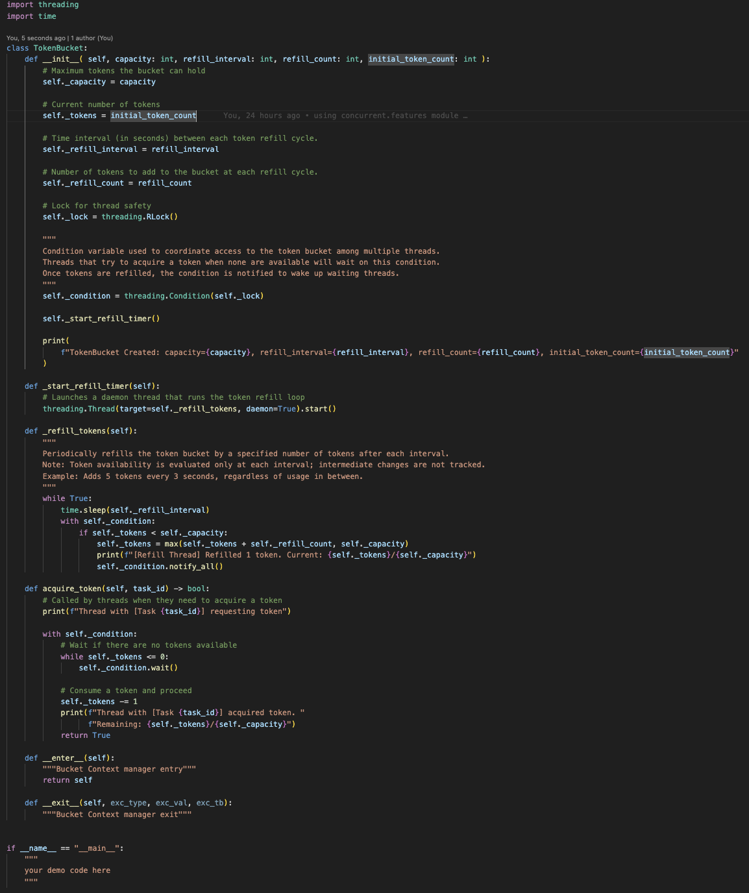

# Thread-Safe Token Bucket in Python

## Problem Statement

In a multithreaded environment, when multiple threads try to acquire tokens concurrently from a shared token bucket, the following issues can occur:

- Race conditions causing inconsistent token counts
- Multiple threads may read stale or conflicting token values
- Token overuse can occur if two threads believe a token is available at the same time

These issues arise due to race conditions when threads access shared state without coordination.

## Solution

To address these problems, a `threading.Condition` is used:
- Only one thread can access or modify the token count at a time
- Threads that fail to get a token wait on the condition
- When a token is added, waiting threads are notified
- This coordination ensures safe, fair, and efficient token consumption

## File Overview

### `token_bucket.py`
- Implements the token bucket logic
- Uses a daemon thread to refill tokens periodically
- Employs `threading.Condition` for safe access and thread coordination
- the `threading.RLock` blocks multiple threas from accesing a code block simultaneously
- the `threading.Condition` acts as a wrapper around the `threading.RLock`
- as long as the context of `threading.Condition` is locked by one thread, another thread will wait until the context is released

### `thread_pool_demo.py`
- Simulates a real-time scenario using `ThreadPoolExecutor`
- Tasks arrive with a delay and try to acquire a token before executing
- Demonstrates thread-safe usage of the token bucket

### `custom_queue_demo.py`
- Python doesnt allow setting priorities for threads unlike Java, hence calling for this workaround 
- Adds a `PriorityQueue` to handle tasks based on arrival time
- Ensures fair execution in the order of task arrival
- Useful when multiple producers are generating tasks dynamically
- does not guarantee order of execution when multiple tasks arrive at the same time or tasks arrive between the refill cycles

## Execution

- clone the project and run `python <name of the demo file>`
- or copy the `token_bucket.py` file and append the demo file code enclosed in `if __name__ == "__main__":` with indentation under the `TokenBucket` class and run the file in your local or an online compiler

